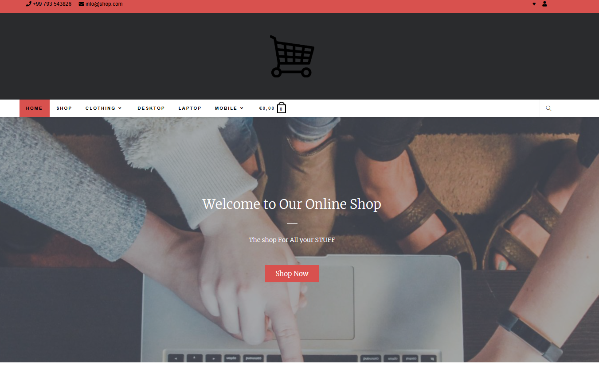
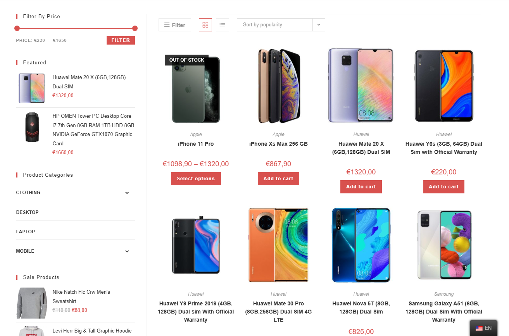
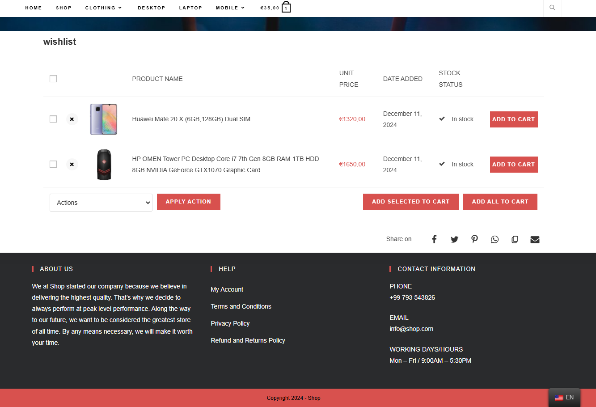
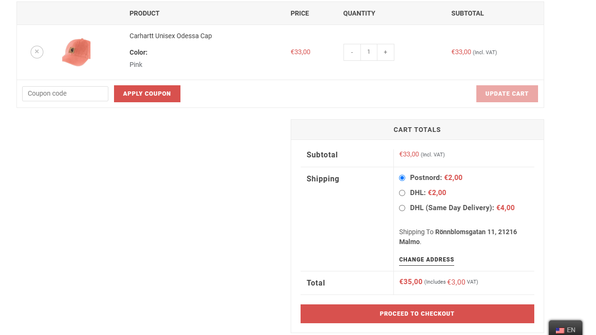
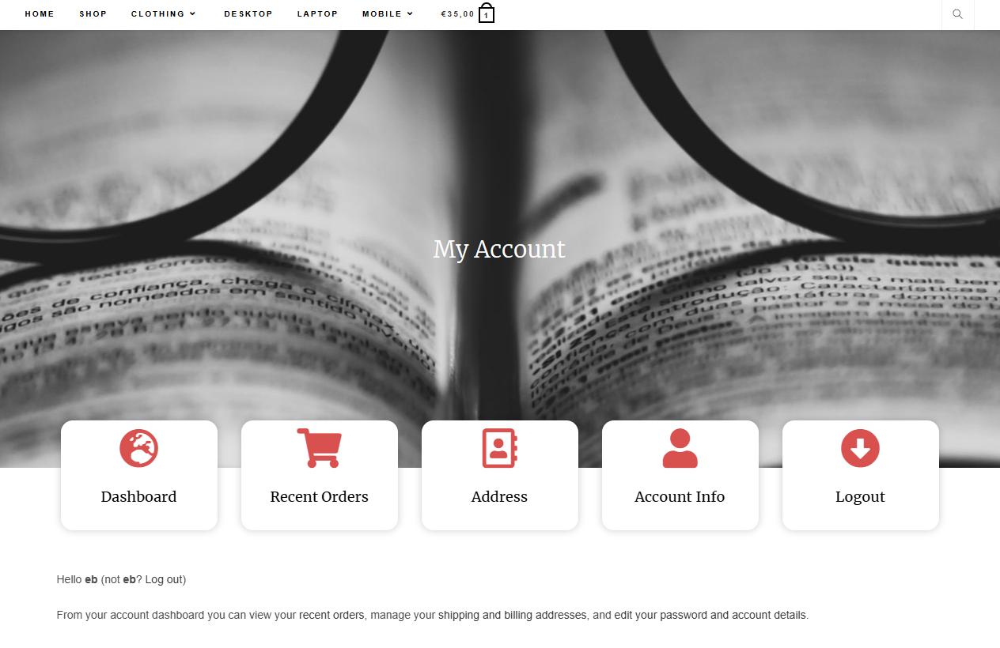

# WordPress eCommerce Shop

Welcome to the **WordPress eCommerce Shop** project! This is a demo site for a fully functional online shop built with WordPress.

## Table of Contents
- [About](#about)
- [Installation](#installation)
- [Usage](#usage)
- [Plugins and Themes](#plugins-and-themes)
- [Contributing](#contributing)
- [License](#license)

## About

This project is a WordPress-based eCommerce website designed to showcase products, accept orders, and integrate payment gateways. The site is fully responsive and features a custom theme designed to provide a seamless user experience.

## Features

This WordPress-based eCommerce shop includes the following key features:

### 1. **Custom eCommerce Setup**
   - Fully functional **WooCommerce** shop for selling products online.
   - Product catalog with categories, filters, and sorting.
   - User registration and login functionality.
   - Shopping cart and checkout process integrated with **Klarna Payments**.

### 2. **Product Management**
   - Easily add and manage products with custom attributes, images, and descriptions.
   - Support for variable products (e.g., different sizes, colors).
   - **Product Image Flipper** for displaying secondary product images on hover (perfect for showing different angles, such as front/back views of clothing).
   - **Product Slider** for showcasing featured products on the homepage or other pages.

### 3. **Page Building with Elementor**
   - Customizable, drag-and-drop page builder with **Elementor** for easy page design.
   - Pixel-perfect design for pages, mobile responsiveness, and advanced editing options.

### 4. **User Experience Enhancements**
   - **Sticky Menu** for easy navigation on scroll.
   - **Wishlist** functionality for customers using **TI WooCommerce Wishlist**.
   - Visual **TranslatePress** integration for translating your site into multiple languages.

### 5. **Security and Performance**
   - **Really Simple SSL** to enable SSL and enhance website security.
   - Optimized for speed and performance with secure payment gateways.

### 6. **Theme and Widget Customization**
   - Customizable WordPress theme using **OceanWP** with additional features via the **Ocean Extra** plugin.
   - **Classic Widgets** plugin to restore the classic widgets interface for easier sidebar and footer management.
   
### 7. **Order Management and Payment Integration**
   - **Klarna Payments** integrated as a payment method for WooCommerce.
   - **Klarna Order Management** plugin for managing orders processed through Klarna.

### 8. **Multilingual Support**
   - Fully compatible with **TranslatePress** for multilingual site translation. Visitors can seamlessly switch between languages.

### 9. **Enhanced Checkout and Payment Options**
   - Integrated **Klarna** checkout for flexible payment options, including Pay Later and Pay Now features.

### 10. **Admin Interface**
   - Easy-to-use WordPress dashboard with all the necessary tools for managing products, orders, and users.
   - View orders, manage inventory, and process payments all from a single interface.

## Screenshots

### Homepage


This is the screenshot of the homepage of the WordPress site.

### Product Page


Here is how the product page looks when viewed by customers.

### Product Detail Page


Here is how the product detail page looks when viewed by customers.

### Wishlist Page


This is the wishlist page where users can favorite their products.

### Checkout Page


This is the checkout page where users can complete their orders.

### Account Page


This is the account page where users have complete control of their account.

## Plugins and Themes

### Active Plugins:
- **Classic Widgets**: Restores the classic widgets interface in Appearance > Widgets and the Customizer, disabling the block editor for widgets.

- **Elementor**: Drag-and-drop page builder for designing pages with pixel-perfect control.

- **Klarna Order Management for WooCommerce**: Provides order management for Klarna Payments and Klarna Checkout gateways.

- **Klarna Payments for WooCommerce**: Adds Klarna Payments as a payment method for WooCommerce.

- **Ocean Extra**: Adds extra features and flexibility to the OceanWP theme for a premium experience.

- **Product Slider for WooCommerce by PickPlugins**: Adds a fully responsive product slider for showcasing products.
- **Really Simple SSL**: Ensures SSL is enabled and improves site security.

- **Sticky Menu (or Anything!) on Scroll**: Makes any element, like a navigation menu, stick to the top as you scroll.

- **TI WooCommerce Wishlist**: Adds a wishlist feature to WooCommerce for users to save products for later.

- **TranslatePress - Multilingual**: A front-end translation editor for translating your WordPress site.

- **WooCommerce**: An eCommerce toolkit that helps you sell anything beautifully.

- **WooCommerce Product Image Flipper**: Shows a secondary product image when hovering over products.

- **WordPress Importer**: Import posts, pages, and media from a WordPress export file.

- **WP Migrate Lite**: Migrate your database, including media, themes, and plugins.

- **Yoast SEO**: Helps improve your site’s search engine optimization (SEO).

### Active Theme:
- **Shop Theme**: A custom-built WordPress theme designed for an eCommerce shop, fully responsive with custom styles for products and checkout.

---

### Highlights:
- It describes the main features your WordPress site offers.
- It includes the active plugins that make the site function as intended.
- Screenshots are embedded to visually showcase parts of the site.
  
Feel free to tweak the content if there are any other specific features or plugins you’d like to include!

## Installation

Follow these steps to set up the WordPress eCommerce shop on your local machine or server.

### Prerequisites:
- A server running PHP and MySQL (e.g., using MAMP, XAMPP, or any LAMP stack).
- WordPress installation.
- A MySQL database.

### Steps:

1. Clone the repository:
    ```bash
    git clone https://github.com/Berger101/Wordpress-Ecommerce-Shop.git
    ```

2. Navigate to the project directory:
    ```bash
    cd your-repository-name
    ```

3. Set up the database:
    - Create a MySQL database.
    - Update the `wp-config.php` file with your database credentials:
    ```php
    define( 'DB_NAME', 'your_database_name' );
    define( 'DB_USER', 'root' );  // or your MySQL user
    define( 'DB_PASSWORD', '' );  // or your MySQL password
    define( 'DB_HOST', 'localhost' ); // add port used
    ```

4. Import the database dump (if provided) or set up your WordPress installation through the web interface.

5. Visit the website:
    - For local development: `http://localhost:8888/your-project-name`

## Usage

Once the installation is complete, you can begin using your WordPress eCommerce shop by following these steps:

### Admin Dashboard
- **Login**: 
  - Go to `http://localhost:8888/shop.test/wp-login.php` (or the appropriate URL based on your setup).
  - Login using your admin credentials (e.g., `admin` and your password).

### Managing Products
- **Add New Products**:
  1. From the admin dashboard, navigate to **Products > Add New**.
  2. Add your product title, description, and other details like price, SKU, and images.
  3. Choose a product category from the available categories.
  4. Set the product's featured image and gallery images.
  5. Once completed, click **Publish** to make the product live.

- **Product Variations** (For variable products like clothing or accessories):
  - Set up product attributes and variations under the **Product Data** section.

### Managing Orders
- **View Orders**: 
  - Navigate to **WooCommerce > Orders** in the dashboard to view and manage customer orders.
  
- **Order Management with Klarna**: 
  - If using Klarna for payments, navigate to **WooCommerce > Settings > Klarna Payments** to configure and manage orders and payments through Klarna.

### Managing Users
- **Customer Accounts**: 
  - Customers can register on your site and manage their accounts by navigating to the **My Account** page.
  
- **Order History**: 
  - Users can track their orders from their account page.

### Translation and Multilingual Support
- **Translate Your Site**: 
  - Using **TranslatePress - Multilingual**, you can translate your site into multiple languages. Visit **TranslatePress > Settings** to manage the languages and translations.

### Front-End Editing
- **Page Building with Elementor**: 
  - Use **Elementor** to drag and drop elements and build custom pages. Go to **Pages > Add New**, and click **Edit with Elementor** to start designing.
  
- **Sticky Navigation Menu**: 
  - The **Sticky Menu (or Anything!) on Scroll** plugin will make any page element (like your navigation menu) stick to the top of the screen when you scroll.

### Wishlist Feature
- **TI WooCommerce Wishlist**:
  - Customers can add products to their wishlist for later purchase. This feature is enabled by the **TI WooCommerce Wishlist** plugin.

### Other Features
- **Product Image Flipper**:
  - The **WooCommerce Product Image Flipper** plugin allows customers to view a secondary image on hover (ideal for products like clothing that have multiple views).

- **SSL and Security**:
  - The **Really Simple SSL** plugin ensures your site is using SSL encryption for secure connections.

### Additional Customizations
- **Custom Widgets**: 
  - The **Classic Widgets** plugin restores the classic widgets interface in **Appearance > Widgets**, allowing you to customize sidebars and footers.

Once you're comfortable with the setup, you can begin adding products, managing orders, and customizing the design further with Elementor and your chosen plugins. Don't forget to update your plugins regularly for the latest features and security patches.

### Admin Login:
- Username: `admin`
- Password: `adminpassword`

## Contributing

Contributions to this project are welcome! Feel free to fork the repository, create a branch, and submit a pull request with your improvements or bug fixes.

### Steps to contribute:
1. Fork the repository.
2. Create a new branch (`git checkout -b feature-name`).
3. Make your changes.
4. Commit your changes (`git commit -m 'Add new feature'`).
5. Push to your branch (`git push origin feature-name`).
6. Submit a pull request.

## License

This project is licensed under the MIT License - see the [LICENSE](LICENSE) file for details.

---

Feel free to customize this `README.md` template to match your specific project details and needs! You can add more sections, update the installation process, or mention specific technologies or plugins you're using.
